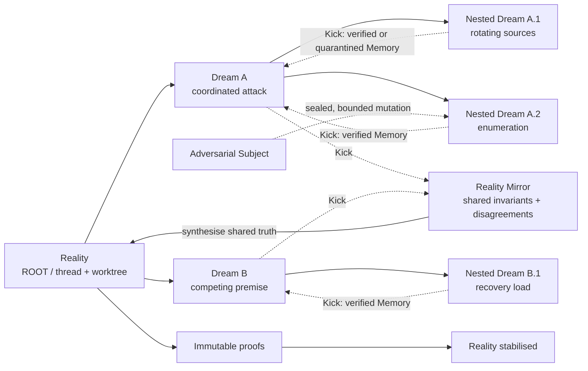

# Inception: Reality Engine

**Developer Tools | OpenAI Build Week | Submission candidate 0.1.0**

Reality Engine lets Codex test a risky software assumption in nested, isolated worlds before it can change the protected repository. **Reality** is that root repository, marked **ROOT** in the graph. Every world owns a premise, constitution, evidence history, Codex thread, and Git worktree. A counterfactual child world is a **Dream**; a bounded Codex subagent is a **Subject**; a **Kick** returns schema-validated **Memory**.

This is not a multi-agent dashboard. It is a proof-gated counterfactual runtime for software decisions.

## Why It Matters

Coding-agent mistakes are paid for by engineers reviewing polluted branches and by users experiencing missed requirements, security defects, and regressions. A normal agent often proposes, implements, and judges a change in one conversation and one filesystem.

Reality Engine makes the uncertainty explicit, explores competing outcomes away from Reality's branch, and admits only evidence-backed Memories and artefacts. A parent-owned **Totem Check** quarantines planted or unsupported Memory automatically. Immutable **Reality Anchors** must pass before good changes can stabilise.

The result is simple to understand without knowing Codex orchestration or Git worktrees: Dreams can affect Reality only after a Kick returns verified Memory.

## Reality Graph



The UI renders this complete parent-child graph, including sibling Dreams, Nested Dreams, the exact path of returning Memory, and quarantined branches. An Adversarial Subject's mutation is rolled back and excluded before Memory can ascend; only independently evidenced knowledge and safe test artefacts can reach the parent.

## Run It Live

Requires Node.js 22.5+, npm, Git, and either the judge's Codex CLI login or an API key. Docker is not required.

```bash
git clone https://github.com/alangunning/inception-reality-engine.git
cd inception-reality-engine
npm ci
codex login              # skip if already authenticated or using an API key
npm run judge:demo
```

Open [http://localhost:3000](http://localhost:3000). `judge:demo` starts full-power real Codex mode with GPT-5.6 and the judge's own authentication. Authentication defaults to `auto`: an explicit `CODEX_API_KEY`, otherwise the judge's Codex CLI login, otherwise `OPENAI_API_KEY`. To deliberately use an API key when CLI auth also exists, set `INCEPTION_CODEX_AUTH_MODE=api` in the ignored `.env`.

Page load, refresh, timeline replay, Admin, and Mission creation never start Codex. Usage begins only after an explicit Codex-backed action.

For credential-free UI evaluation and a deterministic fallback take:

```bash
npm run record:demo
```

Recording mode is deterministic but uses the same domain, worktree, memory-integrity, event, and UI contracts. For the submitted video, complete a fresh real run first, export its safe run log, and record the completed run with adaptive timeline playback rather than waiting for Codex on camera. Live mode remains the recommended technical evaluation.

## What To Try

The immutable password-reset **Demo Mission** is the fastest complete story:

1. inspect an incomplete password-reset boundary;
2. create **Under coordinated attack**;
3. observe attacker, investigator, and test-engineer Subjects;
4. compare **Rotating IP swarm** with the sibling **Account enumeration oracle**;
5. inject Mal into the enumeration Dream under a sealed one-file contract, then watch the Totem Check reveal and contain the planted boundary fault;
6. Kick both nested Dreams and their parent, then synthesise three verified memories;
7. run four immutable proofs and inspect the final Reality diff.

The completed outcome is deliberately concrete: rotating sources deliver `12/12` resets before synthesis and `3/12` after it; known and unknown accounts receive the same response; one planted mutation is rolled back; zero injected files ascend; and all four parent requirements pass across two service instances sharing one abuse budget.

The Demo Mission deliberately uses one parent Dream with two depth-two siblings, so the recording shows genuine counterfactual breadth without multiplying every expensive real-mode investigation. General Missions default to `competing-siblings`: Codex proposes two bounded counterfactuals at every explorable Reality, so a depth-two run may form one ROOT node, two sibling Dreams, and four Nested Dreams before Reality Mirror synthesis.

Use **Start recording auto** for the deterministic video path or **Start guided auto** in real mode. Real guided auto runs bounded Codex actions but pauses before every new Dream premise and after failed immutable proof; **Resume** is the explicit approval to cross that gate. Neither mode starts on page load.

**Mission Control** applies the same engine to a trusted local Git repository. Its default is a pinned VAmPI educational fixture, competing sibling Dreams, editable Subject charters, structured proofs, bounded guided auto mode, and an optional Adversarial Subject. Creating a Mission creates isolated Git state but makes no Codex call.

Judges can inspect:

- one persisted Codex SDK thread and Git worktree per Reality;
- native Subject evidence from SDK collaboration items or Codex's thread registry and structural task completion;
- branching topology, sibling comparison, staged Kicks, and memory ascent;
- automatic intervention rollback, artefact exclusion, and memory quarantine;
- cursor-paged live events, exact plan snapshots, usage evidence, and replay;
- proof-gated synthesis, final beliefs, inherited knowledge, and Git diff.

No raw chain-of-thought, raw model response, credentials, or unrestricted SDK payload is persisted or rendered.

## Verify

```bash
npm test
npm run typecheck
npm run build
npm run test:e2e
npm run verify
```

Playwright uses production rendering, dedicated SQLite/worktree state, and deterministic Codex fixtures. Visual release targets are current Chromium on desktop and tablet.

## Documentation

- [Submission package](./docs/SUBMISSION.md): Devpost description, exact video narration, evidence shots, judge path, and final checklist.
- [Product brief](./docs/PRODUCT.md): audience, problem, mental model, value, and product experience.
- [Product terminology](./docs/TERMINOLOGY.md): canonical UX, event, diagram, and narration language.
- [Demo runbook](./DEMO_RUNBOOK.md): clean-run preparation, live evaluation, recording setup, and recovery.
- [Judge guide](./docs/JUDGING.md): live setup, evaluation map, technical evidence, and submission checklist.
- [Architecture](./docs/ARCHITECTURE.md): package boundaries, trust model, persistence, and diagrams.
- [Runtime flows](./docs/RUNTIME_FLOWS.md): Subjects, worktree inheritance, Kicks, siblings, synthesis, and recovery.
- [Operations](./docs/OPERATIONS.md): auth, usage, process control, cleanup, environment, and platforms.
- [Codex collaboration](./docs/CODEX_COLLABORATION.md): GPT-5.6 contribution, human decisions, and submission evidence.
- [Security](./SECURITY.md): trusted-local threat model for unrestricted real mode.
- [Documentation index](./docs/README.md): all versioned project documents and ADRs.

## Codex Collaboration

Codex and GPT-5.6 were the primary engineering collaborators for architecture inspection, SDK integration, implementation, failure analysis, tests, and desktop/tablet visual QA. The human owner made the product-defining decisions: full-power real mode, no usage on page load, parent-owned Anchors, native Subject proof, automatic memory integrity, adversarial intervention containment, sibling counterfactuals, and a separate Admin boundary.

The Devpost `/feedback` Session ID must be taken manually from the primary Codex build session; application Reality thread IDs are not substitutes. See the [full collaboration record](./docs/CODEX_COLLABORATION.md).

## Support And License

Tested locally on macOS 12.7+ x64/arm64 with current Chromium. Linux x64/arm64 is supported by Node.js and Git and should be verified in CI. Windows native is unverified; WSL2 is expected but unverified.

Licensed under [Apache License 2.0](./LICENSE).
