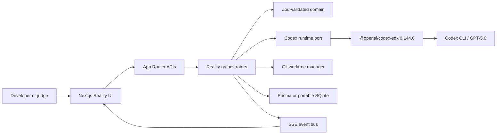
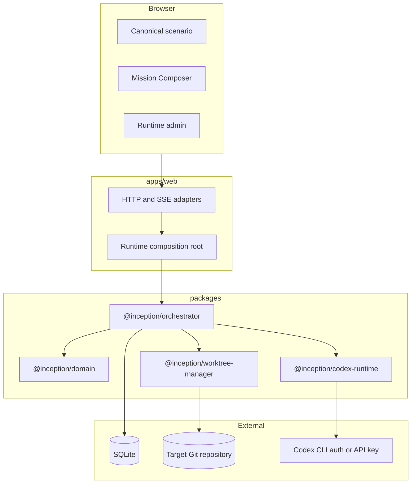
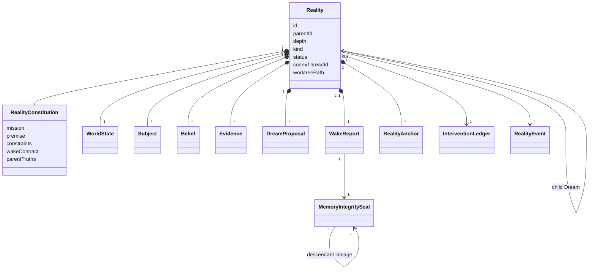

# Architecture

**Architecture version:** 0.1.0
**Status:** Hackathon submission candidate
**Last reviewed:** 2026-07-18

## Purpose

Reality Engine is a developer tool for decisions that a coding agent should not make directly in the waking repository. It turns a material uncertainty into an isolated child Reality, lets Codex and bounded Subjects experience that premise, and returns only validated evidence and artefacts. The parent decides what generalises and proves the result against immutable requirements.

The people who pay for an agent mistake are the engineers reviewing an oversized patch, the team whose main branch is contaminated, and users affected by incomplete security or product invariants. Reality Engine reduces that risk through filesystem isolation, explicit uncertainty, reproducible counterfactual tests, structured memory, and parent-owned proof gates.

## System Context

## Deployment Units

### Boundary Rules

| Package | Owns | Must not own |
| --- | --- | --- |
| `packages/domain` | Entities, value objects, Zod contracts, prompt context | SDK, database, Git, HTTP, React |
| `packages/orchestrator` | Use cases, ports, synthesis policy, proof gates | Codex SDK implementation, shell-specific Git lifecycle |
| `packages/codex-runtime` | SDK threads, GPT-5.6 options, safe event projection, output validation | Persistence and UI rules |
| `packages/worktree-manager` | Worktree creation, inheritance, commands, scoped cleanup | Domain decisions |
| `apps/web` | Composition, routes, SSE, operational presentation | Domain rules |

## Domain Model

- **Reality:** an isolated world with one Codex thread and one Git worktree.
- **Dream:** a child Reality created only from an explicit uncertainty.
- **Subject:** one direct Codex subagent with an identity-bound charter inside a Reality.
- **Wake Report:** validated memory containing beliefs, experiences, invariants, artefacts, and uncertainty.
- **Memory Integrity Seal / Reality Totem:** orchestrator-owned admission record binding one Wake Report to its source state, parent anchors, evidence, artefacts, descendant seals, and intervention verdict.
- **Reality Anchor:** immutable parent-owned proof; a child inherits it but cannot mutate it.
- **Kick:** the transition that stops exploration and requests a Wake Report.
- **Sealed intervention:** optional operator-bounded adversarial mutation applied before investigator Subjects enter; its private ledger is revealed only after diagnosis.

## Runtime Modes

| Capability | Deterministic mock | Real Codex |
| --- | --- | --- |
| Credentials | None | Codex CLI auth or API key |
| Canonical flow | Complete | Complete |
| SDK thread per Reality | Deterministic equivalent | Persisted SDK/CLI thread |
| Git worktree per Reality | Yes | Yes |
| Subject events | Labelled synthetic trace | Native `spawn_agent` and terminal `wait` evidence |
| File writes | Deterministic fixture | Unrestricted inside Reality worktree |
| Mission Composer | Disabled | Enabled |
| Default model | Deterministic mock | `gpt-5.6`, high reasoning |

Real mode is intentionally powerful. Its Codex thread options use `danger-full-access`, `approvalPolicy: never`, network access, live web search, and the Reality worktree as the working directory. This is a trusted local execution model, not a hosted multi-tenant service.

## Data and Trust

All Codex responses cross a Zod boundary before persistence. SDK events are projected into an allowlisted metadata schema; raw reasoning, raw Subject messages, raw agent messages, and unrestricted SDK payloads are discarded. Subject evidence is accepted only when native collaboration events prove both:

1. a `spawn_agent` completed for the exact `SUBJECT_ID`; and
2. a terminal `wait` returned that child thread successfully.

Zod validation establishes structure, not truth. Every Kick therefore runs `MemoryIntegrityService` before the parent receives memory:

1. validate the structured Wake Report;
2. bind its identity to the exact source Reality;
3. bind the complete report to a SHA-256 digest;
4. bind the source worktree to a clean Git checkpoint;
5. compare the child and parent anchor fingerprints;
6. require every changed belief to cite retained source evidence;
7. resolve every safe artefact path or self-contained artefact;
8. require verified seals and unchanged Git sources for all returned descendant memories;
9. compare any sealed intervention with the investigator diagnosis.

New seals use `memory-integrity/v2`; persisted `v1` seals remain readable for retrospective logs. A failed check produces a durable `quarantined` seal and `memory.quarantined` event. The parent reopens the uncertainty; the Wake Report never enters the admitted memory list. Synthesis rechecks report digests, descendant seal IDs, source `HEAD`, and worktree cleanliness, rejecting stale or altered memory without asking for a human approval click.

Confidence values and Dream costs are labelled as model-reported estimates. Trust is derived from evidence:

- **Validated:** Codex output has the required shape.
- **Integrity sealed:** memory passed the automatic parent-owned admission policy.
- **Quarantined:** at least one identity, anchor, evidence, artefact, lineage, or intervention check failed.
- **Unverified implementation:** parent proofs have not run.
- **Proof failed:** at least one immutable proof returned non-zero.
- **Verified:** every configured proof passed.
- **Reality stabilised:** validated memory was synthesised and every parent proof passed.

## Isolation and Cleanup

Canonical, Playwright, and Mission worktrees have distinct roots and branch prefixes. Cleanup is ownership-scoped:

| Owner | Root | Branch prefix |
| --- | --- | --- |
| Canonical | `.inception/worktrees` | `inception/*` |
| Playwright | `.inception/playwright-worktrees` | `inception-playwright/*` |
| Mission | `.inception/missions/<id>/worktrees` | `inception-mission-<id>/*` |

Pinned training targets live in `.inception/training-targets`. They are reusable source caches, not Reality worktrees, and are cloned only by an explicit preparation action. Each Mission still receives separate worktrees and owned branches.

This prevents test resets from deleting live worktrees. If a persisted Reality loses its worktree, the canonical orchestrator restores it from parent state and persisted artefacts without consuming Codex.

## Persistence

Prisma is the production adapter and SQLite is the portable fallback. Both persist validated Reality state, event history, demo sessions, run archives, and Mission runs. The in-memory event bus carries the same validated `RealityEvent` objects over SSE.

## Architecture Decisions

- [ADR-0001: One thread and worktree per Reality](./adr/0001-reality-isolation.md)
- [ADR-0002: Validated memories instead of raw reasoning](./adr/0002-validated-memory.md)
- [ADR-0003: Deterministic and real runtimes share contracts](./adr/0003-dual-runtime.md)
- [ADR-0004: Automatic memory integrity and bounded adversarial intervention](./adr/0004-memory-integrity.md)
