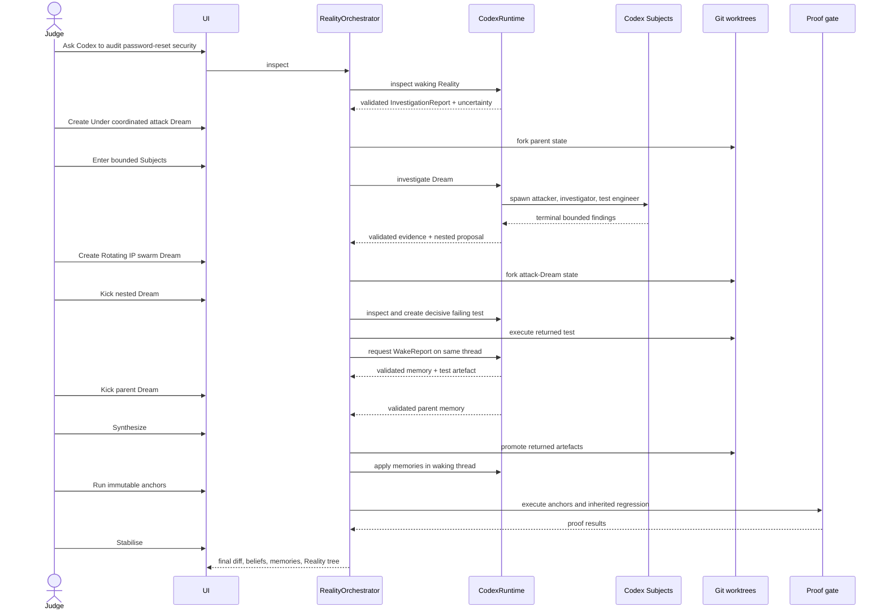
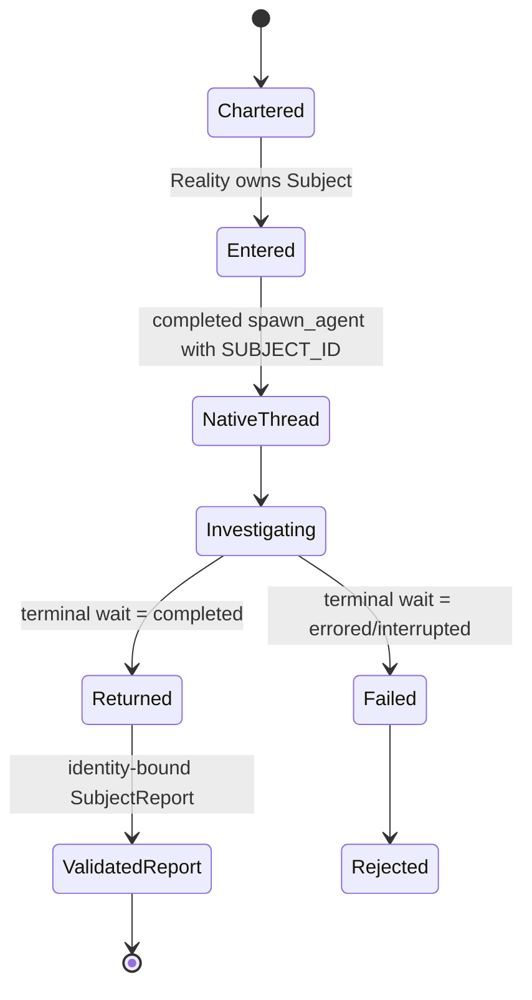
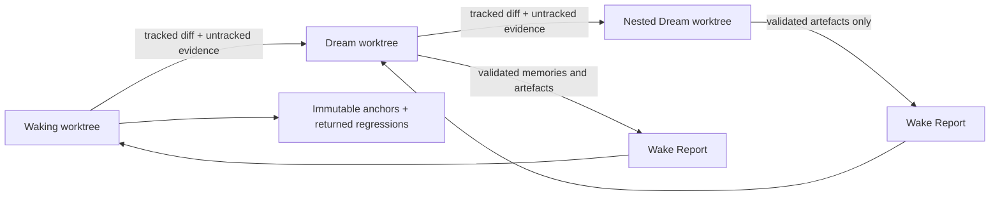
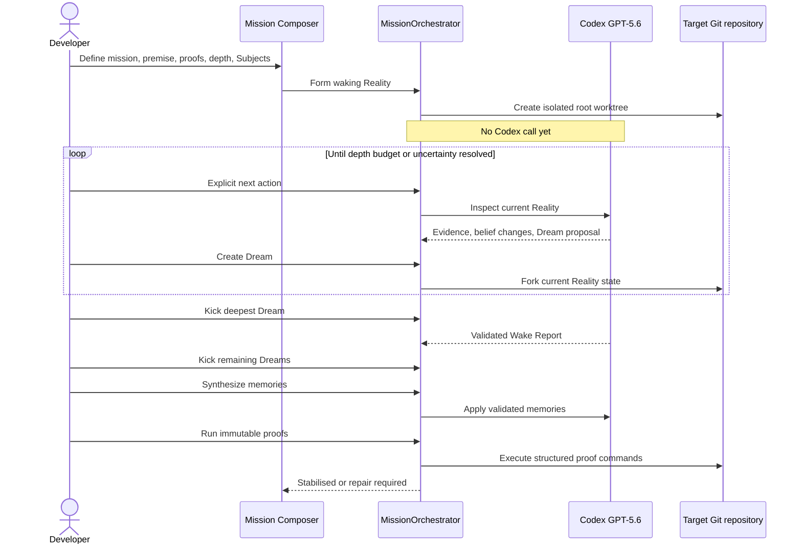
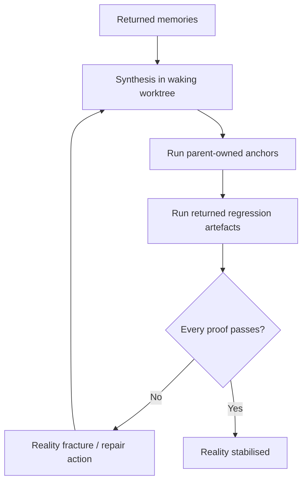

# Runtime Flows

**Flow version:** 0.1.0
**Status:** Hackathon submission candidate
**Last reviewed:** 2026-07-18

## Canonical Three-Level Flow

The nested attack artefact is not prewritten in real mode. The nested Reality must create a real test in its own worktree, retain it, and execute it. The orchestrator requires the pre-synthesis test to fail, proving that the counterfactual exposed a real missing invariant.

## Subject Lifecycle

The safe event stream exposes Subject name, role, state, collaboration tool, and child thread ID. It never exposes the spawn prompt, Subject raw response, or hidden reasoning.

## Worktree Inheritance

Child changes never flow directly into a parent branch. Only a validated Wake Report identifies returnable artefacts; synthesis applies them in the waking worktree.

## Mission Composer

## Refresh and Failure Recovery

- Active operation identity is server-owned; refreshing reloads it from the singleton.
- Every persisted event has wall-clock time, event family, Reality identity, and safe metadata.
- SDK operations and OS-level `codex exec` processes are separately visible in Admin.
- Admin stop first aborts SDK streams, then terminates remaining CLI processes.
- Contract failures become `validation.rejected`; they do not persist malformed model output.
- Missing worktrees are reconstructed from persisted parent state and artefacts.
- Full reset archives safe telemetry, stops Codex, deletes active canonical state, and cleans only canonical-owned worktrees.

## Stabilisation Gate

