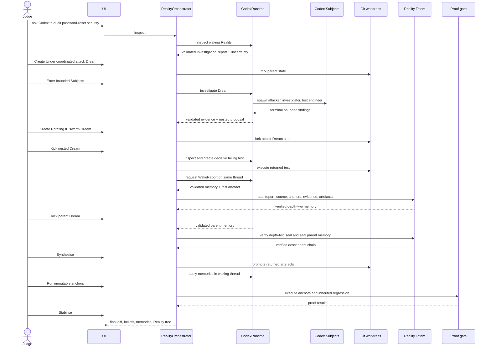
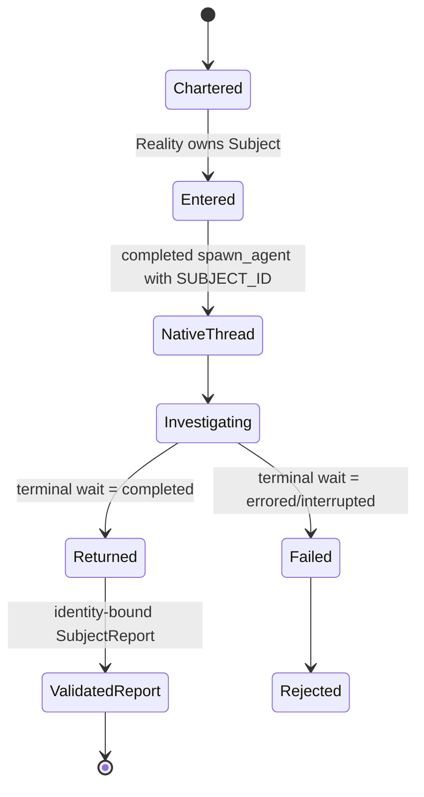
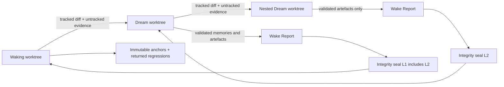
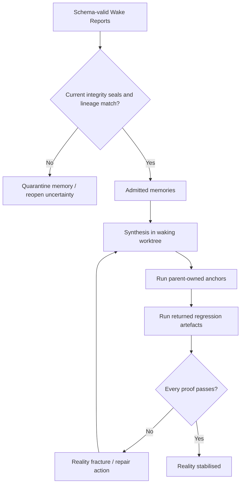

# Runtime Flows

**Flow version:** 0.1.0
**Status:** Hackathon submission candidate
**Last reviewed:** 2026-07-18

## Canonical Three-Level Flow



The nested attack artefact is not prewritten in real mode. The nested Reality must create a real test in its own worktree, retain it, and execute it. The orchestrator requires the pre-synthesis test to fail, proving that the counterfactual exposed a real missing invariant.

## Subject Lifecycle



The safe event stream exposes Subject name, role, state, collaboration tool, and child thread ID. It never exposes the spawn prompt, Subject raw response, or hidden reasoning.

## Worktree Inheritance



Child changes never flow directly into a parent branch. A validated Wake Report is only a memory proposal. The parent receives it after the automatic integrity gate binds report and source digests, confirms its inherited anchors, evidence and artefacts, and verifies every descendant seal. Synthesis applies only currently matching verified seals.

## Mission Composer

```mermaid
sequenceDiagram
  actor Developer
  participant M as Mission Composer
  participant O as MissionOrchestrator
  participant C as Codex GPT-5.6
  participant S as Native Subjects
  participant G as Target Git repository

  Developer->>M: Choose pinned VAmPI or trusted local repository
  opt Curated target
    Developer->>M: Prepare VAmPI locally
    M->>G: Clone allowlisted pinned revision
    Note over M,C: No install, server, traffic, or Codex call
  end
  Developer->>M: Define mission, premise, proofs, depth, Subjects
  M->>O: Form waking Reality
  O->>G: Create isolated root worktree
  Note over O,C: No Codex call yet
  loop Until depth budget or uncertainty resolved
    Developer->>O: Explicit next action
    O->>G: Checkpoint the active Reality
    O->>C: Review local source for the bounded maintenance task
    C-->>O: thread.started; persist resumable Reality thread
    C-->>O: Evidence, belief changes, Dream proposal
    alt Waking inspection or rejected contract
      O->>G: Restore checkpoint
    else Validated Dream inspection
      O->>G: Retain world-local changes
    end
    Developer->>O: Create Dream
    O->>G: Fork current Reality state
    opt Bounded intervention at configured depth
      Developer->>O: Run sealed intervention
      O->>G: Retain rollback checkpoint
      O->>C: Start fresh coordinator
      C->>S: spawn exact chaos-engineer Subject
      S-->>C: one bounded reversible mutation
      O->>G: validate diff and seal private commit
    end
  end
  Developer->>O: Kick deepest Dream
  C-->>O: Validated Wake Report
  O->>O: Verify Reality Totem and descendant seals
  alt Any integrity check fails
    O-->>M: Memory quarantined; uncertainty reopened
  else Integrity verified
    O-->>M: Memory may propagate
  end
  Developer->>O: Kick remaining Dreams
  Developer->>O: Synthesise memories
  O->>G: Recheck sealed commit and clean source worktree
  O->>C: Apply validated memories
  Developer->>O: Run immutable proofs
  O->>G: Execute structured proof commands
  O-->>M: Stabilised or repair required
```

## Refresh and Failure Recovery

- Active operation identity is server-owned; refreshing reloads it from the singleton.
- Every persisted event has wall-clock time, event family, Reality identity, and safe metadata.
- SDK operations and OS-level `codex exec` processes are separately visible in Admin.
- Admin stop first aborts SDK streams, then terminates remaining CLI processes.
- Contract failures become `validation.rejected`; they do not persist malformed model output.
- Missing worktrees are reconstructed from persisted parent state and artefacts.
- Full reset archives safe telemetry, stops Codex, deletes active canonical state, and cleans only canonical-owned worktrees.

## Stabilisation Gate


